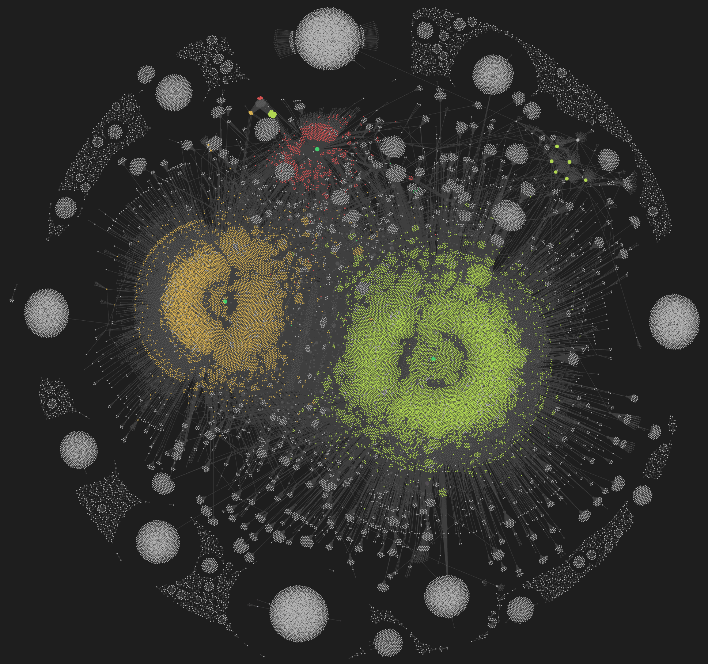
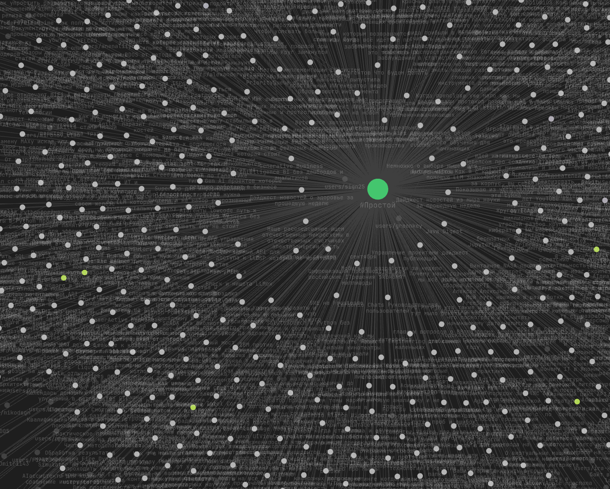
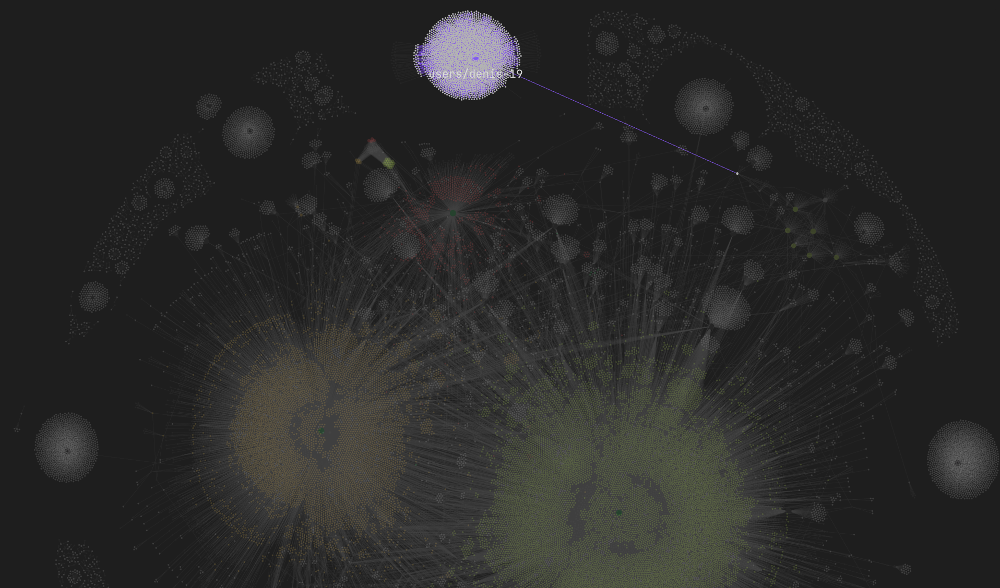
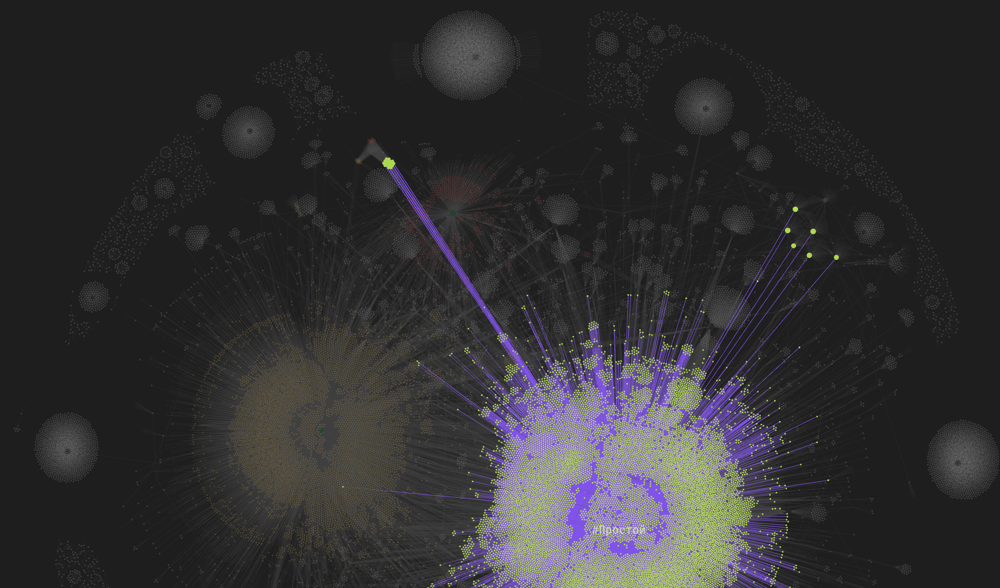

# Что если представить habr в виде obsidian-графа?

Ночью (а точнее уже утром), я не мог уснуть, из-за навязчивой мысли в голове..

А что если спарсить часть статей с хабра и представить их в виде [obsidian](https://obsidian.md/download)-графа, будет ли это выглядеть, как красивая база знаний?

## Откуда датасет

Первым делом, я решил найти API хабра, для получения статей. Как я понял, они закрытые..

Мобильное приложение, насколько я знаю, тоже берёт статьи с сайта, без API.

Тогда, я вспомнил свой старый проект, который я начал делать, когда только учился парсингу (там был ужас по коду), скрапер на beautifulsoup4 и requests.

К моему удилению, когда я откопал его, и запустил, он заработал. За более чем за 2 года названия классов, по которым я получал данные не изменились.

Я решил переписать скрипт на асинхронный aiohttp, чтобы ускорить парсинг, но тут уже сам хабр внёс свои коррективы:

При асинхронном парсинге он кидается 503 статус-кодом и блокирует по ip на некоторое время (ничего личного, просто анти-ddos).

Значит придётся парсить последовательно, страницу, за страницей.

Одну страницу, при максимальной оптимизации, я собираю за `0.5` секунд, значит на парсинг всех статей (порядка миллиона возможных id) уйдёт 140 часов.

``` python
1_000_000 * 0.5 = 170
```

Затем нужно было немного переписать логику:

- Перевести оформление из html в markdown, поддерживаемый в [obsidian](https://obsidian.md/download).
- Разобраться с тегами, пользователями и названиями.

> Интересный факт (из-за этого у меня крашнулся скрипт на начальном этапе): на хабре могут быть статьи без автора. Вы такое видели? Я вот, нет.

Уже начав собирать статьи я столкнулся с интересным поведением в консоли:

``` bash
2025-09-15 00:45:26.017 | DEBUG    | __main__:fetch:77 - [938037:8659] 404
2025-09-15 00:45:26.598 | SUCCESS  | __main__:fetch:80 - [938036:8660] ok
2025-09-15 00:45:26.017 | DEBUG    | __main__:fetch:77 - [938035:8661] 404
2025-09-15 00:45:26.598 | SUCCESS  | __main__:fetch:80 - [938034:8662] ok
```

Статьи с нечётным id всегда выдавали статус-код 404, не найдено.

Я написал небольшой скрипт, для анализа логов. И моя гипотеза действительно подтвердилась: на хабре нет статей с нечётным id и это ускорит сбор статей в 2 раза.

Но в итоге, после очередного сбоя, я решил ограничиться базой из 43К статей (при таком кол-ве обсидиан загружает граф, в течение получаса).

## Связи

[Obsidian](https://obsidian.md/download) полюбили за возможность создания связей между заметками: теги, папки и так далее.

Если их не использовать, то магии на графе не будет.

Я решил ограничиться тегом сложности статьи и указанием автора в начале, однако, пришлось загружать полный текст статьи, чтобы работали ссылки на пользователей/другие статьи, оставленные авторами.

Также кол-во просмотров, время на чтение и дата публикации записаны в метаданные статей, но в построении графа не участвуют (если будет слишком много данных, для создания связей, графу это может повредить).

## Результаты

На выходе мы имеем такой граф:



Каждая точка - статья. Статьи сгруппированы по сложности (соответствующий цвет).



По графу, можно анализировать некоторые вещи, к примеру, отдельностоящие круглые скопления точек это авторы с самым большим кол-вом статей.

Вот, к примеру, скопление статей [@denis-19](https://habr.com/users/denis-19):



Самое интересное, что при наведение на статью/тег/автора мы видим всё, что с ним связано:



Благодарю за прочтение. Исходники доступны [тут](https://gist.github.com/iamlostshe/438ac20068c81ffb58dabc3f953d8633).
