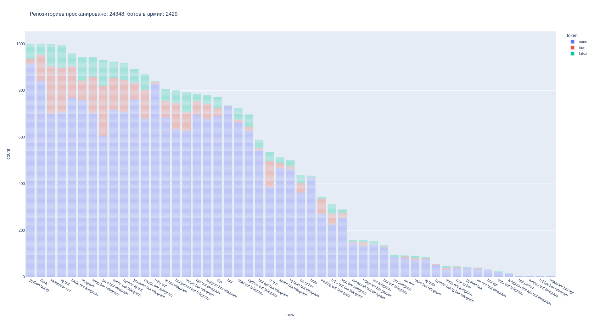

# Ищу слитые в опен сорс токены ботов

> Я уже упоминал этот проект, как возможность продвижения, в заметке про [скам-бота](https://t.me/iamlostshe_blog/59).

Многие люди публикуют свои проекты на [github](https://github.com/)-подобных git-хостингах, для обеспечения общего доступа (это даёт множество преимуществ во многих случаях).

Часто, ввиду неопытности, при публикации, люди сливают чувствительные данные (в частности токены Telegram-ботов).

> Я и сам, пару раз, по неосторожности сливал свои токены. Интересно то, что оба раза токены были обнаружены.

В этой статье я постараюсь ответить на следующие вопросы:

0. Какая подготовка необходима?
1. Насколько реально на данный момент найти утечки токенов? 
2. Сколько токенов я найду и сколько из них будут работоспособными?
3. Что по конкуренции?
4. Насколько критична для бота утечка его токена?

## 0. Какая подготовка необходима?

Для начала нам нужно запастись базовым функционалом:

- Разработать регулярные выражения для поиска токенов.
- Написать скрипт для анализа репозиториев.
- Написать панель.

Регулярное выражение для поиска:

``` python
# tg (bot)
[0-9]{9,10}:AA[A-Z][a-zA-Z0-9_-]{32}
```

> Я бы мог чекать токены и для других платформ, но меня это не особо интересовало.

> Было бы круто иметь инструментарий для быстрой проверки своих репозиториев на наличие чувствительных данных.

Для написания скрипта, нужно разобраться с логикой и стеком.

Изначально, я хотел писать на `rust`, ввиду его скорости, т. к. предстояло просканировать огромное кол-во репозиториев.

Но потом я вспомнил одну [популярную статью](https://medium.com/@sharon.brizinov/how-i-made-64k-from-deleted-files-a-bug-bounty-story-c5bd3a6f5f9b), схожей тематики, там были представлены исходники на `python` и в статье, для демонстрации работы был код на `sh` (терминал, по большому счёту).

Вкратце, алгоритм доставал удалённые файлы из репозитория и проверял наличие чувствительных данных внутри.

Так и родилась идея, связки:

- `Sh`

Скрипт  клонирование репозитория, через `git` и поиск удалённых файлов).

> Я пошёл ещё дальше, и использовал [gix](https://github.com/GitoxideLabs/gitoxide) (`git` на `rust`) внутри `sh` скрипта (он значительно ускорил работу).

- `Python`

Но для анализа репозиториев, нам нужно сначала где-то их взять. Логичным решением было использование [GitHub API](https://docs.github.com/ru/rest). 

Затем я сделал минимальную панель:

- База данных
- Кеш
- Логи

И небольшое ответвление для аналитики. Анализировал логи, ибо изначально не указал нужных данных в бд. Интересное направление деятельности, напоминает задачки из ЕГЭ, только чуть сложнее.

## 1. Насколько реально на данный момент найти утечки токенов?

В первый день анализа я нашёл порядка 20 токенов и был очень рад этому, правда, были проблемы со стабильностью системы. Но после немногочисленных фиксов, всё заработало.

Тогда еще не было скрипта, для автопроверки токенов, и приходилось вручную их проверять.

Вывод: токены найти можно.

## 2. Сколько токенов я найду и сколько из них будут работоспособными?

После доработок я запустил автопоиск на несколько дней.

Вот краткая сводка данных:

`Репозиториев просканировано: 24348`
`Токенов найдено: 2429`

> То есть, токены сливают, в каждом десятом репозитории..

Также, скрипт для аналитики поддерживает генерацию графиков распределения токенов по поисковым запросам:




## 3. Что по конкуренции?

При запуске первых найденных мной ботов, они почти сразу выводили в консоль сообщение о конфликте. Значит, конкуренция, всё таки присутствует.

Большинство ботов используются в рекламных целях.

> Однако, мне удавалось находить и крупных ботов, без конкуренции, которые админят крупные чатики (по странному стечению обстоятельств, они все были на арабском), у одного из них было 50к пользователей в месяц.

## 4. Насколько критична для бота утечка его токена?

Думаю тут особо пояснения не нужны, ваш бот полностью под чужим контролем.

Однако, при утечке, можно переиздать токен у BotFather-а за несколько секунд.

> Кстати, я видел несколько ботов, у которых поменяли оформление (в рекламных целях), имея только токен. Правда, я пока не понял как..

## Применение для "армии ботов"

Логичным вопросом будет: "а что даст злоумышленнику личная армия ботов?".

В качестве эксперимента, я решил заставить ботов отвечать на любое сообщение `"Hacked by @iamlostshe_blog"`, указав юзернейм своего канала.

Итоги скоромные: `+1 подписчик, ~150 просмотров, +3 реакции` (боты были запущены в течение 20 минут).

Я связываю, такую активность, с тем, что аудитория не целевая, большая часть, даже не говорит на русском.

Однако, армия отлично подойдёт для задач, где не важна целевая группа (опять же, [скам-бот](https://t.me/iamlostshe_blog/59), фишинг).

> Кстати, параллельный запуск настолько большого кол-ва ботов, не такая уж и простая задачка для компьютера. Лично у меня при запуске, комп начинает шуметь, как турбина (у меня ведро).
